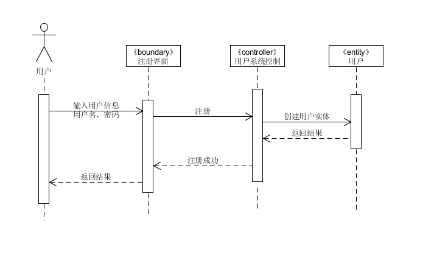
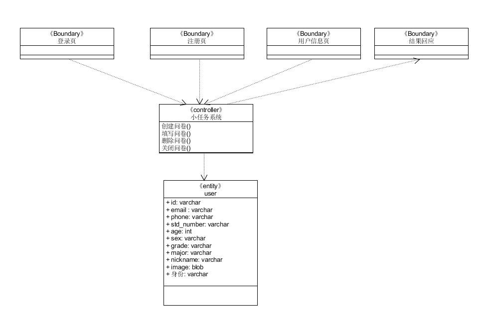
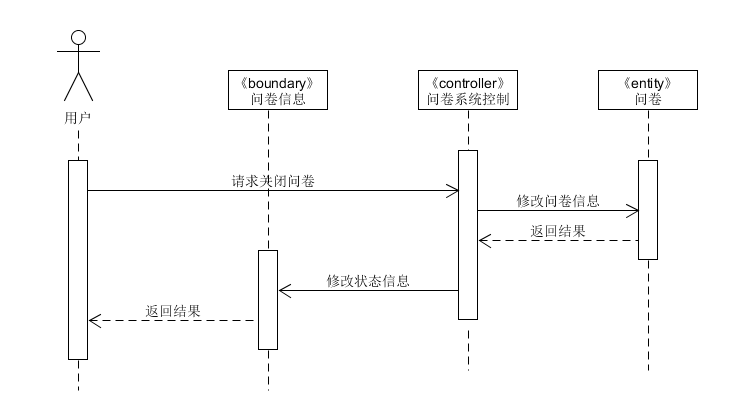

# 用例设计

# 1. 信息管理

- Entity：用户
- Boundary：登录页， 注册页， 用户信息页， 结果回应页
- Controller： 用户系统控制

## 1. 1 登录

- EBC 顺序图

## 1.2 注册

- EBC 顺序图

## 1.3 修改信息

- EBC 顺序图

# 信息管理类图

# 2. 问卷系统

- Entity：用户（问卷发布者）、  用户（问卷填写者）、  问卷  
- Boundary：问卷信息页， 结果回应页
- Controller： 问卷系统控制

## 2.1 发布问卷

- EBC 顺序图

## 2.2 修改问卷

- EBC 顺序图

## 2.3 填写问卷

- EBC 顺序图

## 2.4 关闭问卷

- EBC 顺序图

## 2.5 删除问卷

- EBC类图 

# 3. 小任务系统

- Entity：用户（小任务发布者）、  用户（小任务完成者）、  小任务
- Boundary：小任务信息页，操作结果回应页、锁定结果回应页
- Controller： 小任务系统控制

## 3.1 发布小任务

- EBC 顺序图

## 3.2 修改小任务

- EBC 顺序图

## 3.3 锁定并完成任务

- EBC 顺序图

##  3.4 小任务系统 EBC类图 

