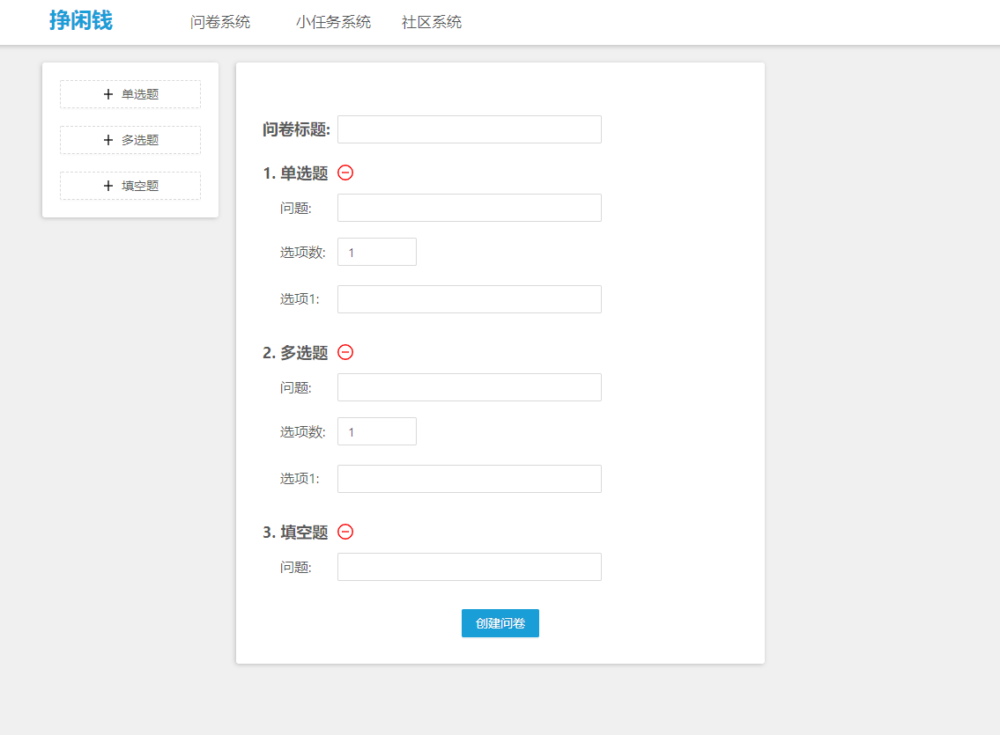
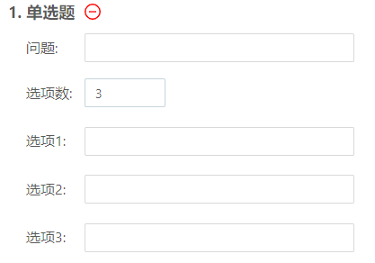

# Vue数据绑定-问卷实现

Vue强大的数据绑定功能让开发过程完全脱离DOM访问，没有了复杂难用的DOM操作，开发效率也大大提升，而这次挣闲钱项目的新建/修改问卷界面就是一个用到略复杂数据绑定的场景。

## 需求分析

首先来看这个界面的需求：除问卷标题外，共有三种问题（单选题，多选题，填空题），用户除了填写问题内容外，还可以随时增删问题，并且对于选择题可以修改选项数目：



## 数据格式

固定数目的表单很简单，使用v-model就可以实现，而这里要求问题和选项都是动态的，就需要比较复杂的数据绑定了，除了绑定问题外，还要绑定选项数，这里用到的初始绑定的数据如下：

```js
qn: {
  title: null,
  q: [
    // {type: 'single', name: 'sn', cnum: 3, choices: ['c1', 'c2', 'c3']},
    // {type: 'multi', name: 'mn', cnum: 3, choices: ['c11', 'c22', 'c33']},
    // {type: 'text', name: 'name'}
  ]
}
```

q是存放所有问题的数组，用v-for进行显示；选择题中cnum存储选项数目，choices存储每个选项。

## 绑定编写

有了基本数据类型，我们先在左侧写好增加三种问题的按钮，点击按钮后会向问题列表中添加对应的问题：

```js
addSingle: function () {
  this.qn.q.push({ type: 'single', name: '', cnum: 1, choices: [] })
},
addMulti: function () {
  this.qn.q.push({ type: 'multi', name: '', cnum: 1, choices: [] })
},
addText: function () {
  this.qn.q.push({ type: 'text', name: '' })
}
```

问卷的显示使用v-for实现，我们项目的前端使用了ant-design库，它的radio和checkbox控件组分别当作单选和多选问题的数据类型，将对应输入的选项和对应问题进行绑定即可：

```html
<!-- 问题列表 -->
<div class="qn-cell" v-for="(q, i) in qn.q" :key="i">
  <!-- 单选题 -->
  <div v-if="q.type=='single'">
    <div class="qn-title">{{i+1}}. 单选题</div>
    <a-icon class="qn-delete-button" type="minus-circle-o" @click="removeQ(i)" />
    <div>
      <p class="qn-name">问题: </p><a-input class="qn-input" v-model="q.name" />
    </div>
    <div>
      <p class="qn-name">选项数: </p><a-input-number :min="1" :max="5" v-model="q.cnum" />
    </div>
    <div v-for="j in q.cnum" :key="j">
      <p class="qn-name">选项{{j}}: </p><a-input class="qn-input" v-model="q.choices[j-1]" />
    </div>
  </div>
  <!-- 多选题 -->
  <div v-else-if="q.type=='multi'">
    <div class="qn-title">{{i+1}}. 多选题</div>
    <a-icon class="qn-delete-button" type="minus-circle-o" @click="removeQ(i)" />
    <div>
      <p class="qn-name">问题: </p><a-input class="qn-input" v-model="q.name" />
    </div>
    <div>
      <p class="qn-name">选项数: </p><a-input-number :min="1" :max="5" v-model="q.cnum" />
    </div>
    <div v-for="j in q.cnum" :key="j">
      <p class="qn-name">选项{{j}}: </p><a-input class="qn-input" v-model="q.choices[j-1]" />
    </div>
  </div>
  <!-- 填空题 -->
  <div v-if="q.type=='text'">
    <div class="qn-title">{{i+1}}. 填空题</div>
    <a-icon class="qn-delete-button" type="minus-circle-o" @click="removeQ(i)" />
     <div>
      <p class="qn-name">问题: </p><a-input class="qn-input" v-model="q.name" />
    </div>
  </div>
</div>
<!-- 问题列表结束 -->
```

其中的选项数量绑定使用ant-design的a-input-number控件实现，输入的数目与选项数动态绑定：



此外还要有一个删除问题的函数，点击删除按钮可以随时删掉这个问题：

```js
removeQ: function (i) {
  this.qn.q.splice(i, 1)
}
```

## 完成与表单提交

这样就实现了我们要求的动态增删问题和动态改变选项数的问卷表单了。在编写绑定时需要注意选择v-model应该绑定的数据，把ant-design的控件参照文档读懂，若绑定错误就会出现各种显示错误。

最后与后端的数据交互再加上本地验证和post请求即可。本地验证表单输入：

```js
if (this.isNULL(this.qn.title)) { // empty title
  this.$message.warning('请填写问卷标题!')
  return
}
if (this.qn.q.length === 0) { // empty questions
  this.$message.warning('请至少添加一个问题')
  return
}
for (let i = 0; i < this.qn.q.length; i++) {
  let que = this.qn.q[i]
  if (this.isNULL(que.name)) { // empty question title
    this.$message.warning('问题' + (i + 1) + '的标题为空')
    return
  }
  if (que.type === 'text') { // input question
    continue
  }
  if (que.cnum !== que.choices.length) { // invalid choice num or empty
    this.$message.warning('问题' + (i + 1) + '的选项为空或选项数不匹配')
    return
  }
}
```

数据请求：

```js
var tSelectQ = []
var tFillQ = []
for (let i = 0; i < this.qn.q.length; i++) {
  let que = this.qn.q[i]
  let tque = {}
  if (que.type !== 'text') { // select question
    tque = {
      title: que.name,
      option_num: que.cnum,
      mytype: que.type === 'single' ? '单选' : '多选',
      option: []
    }
    for (let j = 0; j < que.choices.length; j++) {
      tque.option.push({ text: que.choices[j] })
    }
    tSelectQ.push(tque)
  } else { // fill question
    tque = {
      title: que.name
    }
    tFillQ.push(tque)
  }
}
// console.log(JSON.stringify(tSelectQ))
// console.log(JSON.stringify(tFillQ))
// post
axios
  .post('/paper/create/', {
    title: this.qn.title,
    select_question_num: tSelectQ.length,
    fill_question_num: tFillQ.length,
    Question_select: tSelectQ,
    Question_fill: tFillQ
  })
  .then((response) => {
    var resp = response.data
    // console.log(resp)
    if (resp.code === 3) { // success
      this.$message.success('创建问卷成功')
      this.$router.push({ path: '/guide/qnHome' })
    }
  })
  .catch((error) => this.$message.error(error))
```
