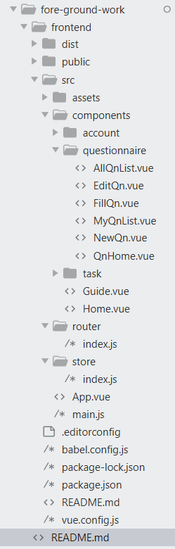

## 前端设计

### 技术选型

我们的项目是一个前后端分离的单页面web应用，技术栈是**vuejs + webpack + ant-design**，以下是选用这些工具开发的理由及简介：

**vuejs**：MVVM结构的前端框架，响应式设计，适用于前后端分离的SPA应用开发。vuejs框架采用了组件式设计，降低每个页面间的耦合度。vue提供了强大的数据绑定组件，在编程时完全不用访问DOM，因而也用不到jQuery，大大降低了开发难度，同时中文文档很详细。

**webpack**：前端打包工具，对于开发前后端分离的SPA应用来说十分便捷。

**vue-cli**：[vue-cli3.0框架]([https://cli.vuejs.org/zh/](https://cli.vuejs.org/zh/))集成了webpack等常用工具包，提供模拟服务器运行及热加载，作为脚手架工具简化了开发过程中的环境搭建步骤。

**ant-design**：[ant-design-vue]([https://vue.ant.design/docs/vue/introduce-cn/](https://vue.ant.design/docs/vue/introduce-cn/))是一个支持vue的UI库，控件齐全，使用简单，采用UI库简化了css样式的编写，且ant-design提供的默认控件样式有不错的样式和过渡效果。

在开发中还用到了一些小组件：
* **axios**：第三方http库，用promise封装了get和post请求。
* **vue-router**：vuejs的路由组件，提供了前端路由导航，组件传参，路由过滤等功能。
* **vuex**：vuejs的状态管理组件，全局存储数据，用于在前端保存登录状态及用户信息。

### 软件设计技术

**MVC**：项目整体设计采用了MVC架构，将项目按逻辑划分为三个部分：Model - View - Controller，没有填充数据的前端界面和后端数据模型可看作Model部分，填充数据后的前端作为View，后端的路由和数据交互充当controller部分，这样三个部分间就有看上去比较清晰的关系，将项目中的每个组件与MVC的部分对应。

**MVVM**：我们开发的是一个前后端分离的应用，前端使用的vuejs框架为前端部分带来了MVVM架构：Model，View，View - Model。相比MVC，加入了View Model部分，其实就是vuejs最常用的数据模板，在填充数据后成为View。MVVM架构能让前端更好地充当分离式前端的角色，更专注于页面编写，与后端只处理数据交互。

**Object Oriented Programming**：vuejs的组件设计让前端开发专注于每个页面的开发，且由于每个页面是一个单独的组件，耦合较低，面向对象编程OOP就是前端页面组件开发的核心思想，将每个页面组建看成一个功能不同的对象（页面划分见下方模块划分部分）。

**SPA**：前后端分离的单页面应用，即Single Page Application，降低了前后端耦合，采用前端路由，专注于页面开发，只与后端进行数据交互，是vuejs体系中的一个核心部分。

### 模块划分

vuejs的MVVM架构让开发过程专注于页面的编写，我们的前端部分共由以下几部分页面组成：
* 注册登录界面
* 主导航界面
* 问卷调查的系列页面
* 小任务系统的系列页面



前端代码树形图(用工具[treer](https://www.npmjs.com/package/treer)生成)：

```
├─babel.config.js
├─package-lock.json
├─package.json
├─README.md
├─vue.config.js // vue配置文件
├─src
|  ├─App.vue // 主组件
|  ├─main.js // 项目入口
|  ├─store
|  |   └index.js // vuex文件
|  ├─router
|  |   └index.js // vue-router配置文件
|  ├─components // 所有子组件
|  |     ├─Guide.vue // 主导航界面
|  |     ├─Home.vue // 根界面
|  |     ├─task // 小任务系统组件
|  |     |  ├─NewTask.vue
|  |     |  ├─TaskDetail.vue
|  |     |  ├─TaskHome.vue
|  |     |  └TaskList.vue
|  |     ├─questionnaire 问卷调查组件
|  |     |       ├─AllQnList.vue // 全部问卷列表页面
|  |     |       ├─EditQn.vue // 编辑问卷页面
|  |     |       ├─FillQn.vue // 填写问卷页面
|  |     |       ├─MyQnList.vue
|  |     |       ├─NewQn.vue // 新建问卷页面
|  |     |       └QnHome.vue // 问卷根页面
|  |     ├─account
|  |     |    ├─Signin.vue // 登陆页面
|  |     |    └Signup.vue // 注册页面
|  ├─assets
|  |   ├─avatar.jpg
|  |   ├─favicon.ico
|  |   ├─home-carousel-1.jpg
|  |   ├─home-carousel-1.png
|  |   ├─home-carousel-2.jpg
|  |   ├─home-carousel-3.jpg
|  |   ├─home-carousel-4.jpg
|  |   ├─home-detail-1.jpg
|  |   ├─home-detail-2.jpg
|  |   └qncover.jpg
├─public
|   ├─index.html // html文件
|   ├─static
|   |   └favicon.ico
├─dist // 打包目录
|  ├─index.html
|  ├─static
|  |   ├─favicon.ico
|  |   ├─js
|  |   | ├─app.c7868cb2.js
|  |   | ├─app.c7868cb2.js.map
|  |   | ├─chunk-vendors.552d5829.js
|  |   | └chunk-vendors.552d5829.js.map
|  |   ├─img
|  |   |  ├─avatar.f5009b8c.jpg
|  |   |  ├─home-carousel-1.70735838.png
|  |   |  ├─home-carousel-2.8b347fd3.jpg
|  |   |  ├─home-carousel-3.d201e704.jpg
|  |   |  ├─home-carousel-4.4d24e122.jpg
|  |   |  ├─home-detail-1.bbc5b2ce.jpg
|  |   |  └home-detail-2.541c6dfc.jpg
|  |   ├─css
|  |   |  ├─app.1408651e.css
|  |   |  └chunk-vendors.53600669.css
```


### 关键实现

* vuex全局状态存储。vuex可以存储用户的登录状态及账户信息，而刷新有可能丢失数据，因此我采用了localstorage存储vuex数据，监听浏览器刷新事件，在刷新前后读写localstorage，实现了刷新和关闭浏览器都不会丢失用户信息。

```js
created: function () {
  // 在页面加载时读取localStorage里的状态信息
  if (localStorage.getItem('store')) {
    this.$store.replaceState(Object.assign({}, this.$store.state, JSON.parse(localStorage.getItem('store'))))
  }
  // 在beforeunload页面刷新时将vuex里的信息保存到localStorage里
  window.addEventListener('beforeunload', () => {
    localStorage.setItem('store', JSON.stringify(this.$store.state))
  })
}
```

* 页面访问权限。只有登录过的用户才能访问应用界面，否则会跳转到登录界面，采用vue-router全局守卫监听路由跳转，检查vuex中存储的登录状态，对未登录的情况进行跳转。

```js
router.beforeEach((to, from, next) => {
  if (to.path !== '/signin' && to.path !== '/signup') { // if jumping to ~sign page, check if login
    if (store.state.userInfo == null) {
      next('/signin')
    }
  }
  next()
})
```

* 与后端对接。我们项目的后端采用的是django框架，由于前后端分离的项目特性，前后端对接的大部分工作都是数据交互，axios可以设置一个全局请求url的置换，在开发时将数据转发到后端服务器端口，在开发完成打包时取消这个转发。

### 开发计划及更新日志

| 开发阶段 | 时间 | 任务 |
| --- | --- | --- |
|第一阶段| 1-5周   |  需求调研，原型构思 |
|第二阶段| 6-10周  |  环境搭建，原型搭建 |
|第三阶段| 10-14周 |  实现页面模块       |
|第四阶段| 15-18周 |  对接数据，测试，完善界面   |

[更新日志](https://github.com/Walikrence/swsad-project/tree/master/fore-ground-work)
